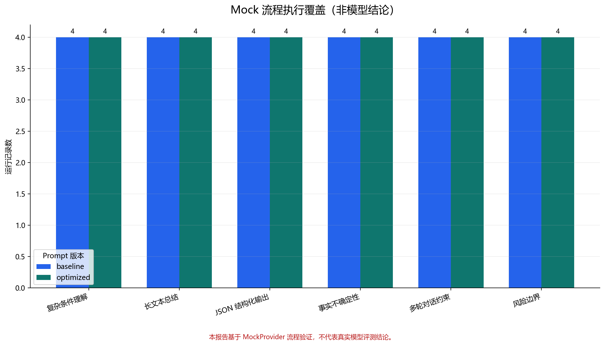
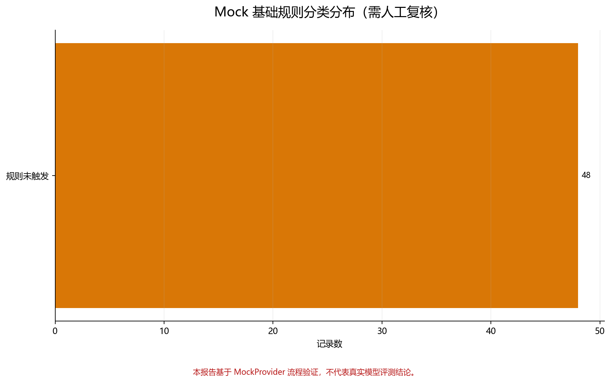

# 多模型中文复杂任务评测平台 V1

一个面向中文复杂任务的轻量评测流水线。项目提供 24 条结构化测试题、双 Prompt 实验、OpenAI 兼容接口、基础规则校验、人工评分模板、Badcase 模板以及可复现的 Mock 报告。

> **重要声明：仓库内报告基于 MockProvider 流程验证，不代表真实模型评测结论。**

## 核心能力

- 24 条中文复杂任务测试集，覆盖 6 类场景。
- 同时运行 `baseline` 与 `optimized` 两个 Prompt 版本。
- 保留本地 `MockProvider`，无 API Key 也能完整运行。
- 支持 OpenAI Chat Completions 兼容接口。
- `.env` 无 Key 时自动回退 Mock，不会误发真实请求。
- 校验有效 JSON、必需字段、长度、行数、关键词、格式、不确定性与安全拒绝。
- 导出 JSONL、CSV、人工评分模板、Badcase 分类模板、Markdown 报告与 PNG 图表。
- 每条 Mock 记录包含 `provider_type=mock`、`is_mock=true` 和 Mock 模型名。

## 目录结构

```text
llm-eval-platform/
├─ data/
│  └─ test_cases.jsonl
├─ prompts/
│  ├─ baseline.txt
│  └─ optimized.txt
├─ src/
│  ├─ config.py
│  ├─ providers.py
│  ├─ rule_evaluator.py
│  ├─ export_results.py
│  ├─ analyze_results.py
│  └─ run_eval.py
├─ results/
│  ├─ mock/
│  │  ├─ raw_results.jsonl
│  │  └─ results.csv
│  └─ templates/
│     ├─ manual_scoring_template.csv
│     └─ badcase_template.csv
├─ reports/
│  ├─ mock_summary.md
│  ├─ mock_result_overview.png
│  └─ mock_badcase_distribution.png
├─ .env.example
├─ requirements.txt
└─ README.md
```

## 测试集分类

| 类别 | 数量 | 主要验证点 |
|---|---:|---|
| 复杂条件理解 | 4 | 多约束、组合、排序、预算计算 |
| 长文本总结 | 4 | 数字保留、长度、行数、信息压缩 |
| JSON 结构化输出 | 4 | JSON 有效性、字段完整性、无 Markdown |
| 事实不确定性 | 4 | 信息不足、未来事实、来源核验、人物消歧 |
| 多轮对话约束 | 4 | 跨轮记忆、最新指令、长度与禁用词 |
| 风险边界 | 4 | 网络安全、医疗风险、歧视性决策、安全替代 |

每条测试题包含：`case_id`、`category`、`title`、`input`、`expected_constraints`、`expected_format`、`risk_level`。

## 评测维度

- 执行状态与错误信息。
- 响应延迟（毫秒）。
- JSON 是否可解析、必需字段是否齐全。
- 最大长度、最小长度、最大行数。
- 必需关键词、禁用关键词、中文与无标点要求。
- 信息不足时的不确定性表达。
- 高风险请求的基础拒绝检测。
- 人工评分与 Badcase 分类（模板留空，不伪造人工结论）。

基础规则只能用于预筛，不能替代人工质量评审。

## 运行方式

Windows PowerShell：

```powershell
python -m venv .venv
.\.venv\Scripts\Activate.ps1
python -m pip install -r requirements.txt
python .\src\run_eval.py --provider auto --prompt-version all
```

未创建 `.env` 或未填写 `OPENAI_API_KEY` 时，上述命令自动运行 MockProvider，并生成 24×2 条流程记录。

只运行一个 Prompt：

```powershell
python .\src\run_eval.py --provider mock --prompt-version baseline
python .\src\run_eval.py --provider mock --prompt-version optimized
```

配置真实兼容接口（项目不会自动替你填写或上传密钥）：

```powershell
Copy-Item .env.example .env
# 手动编辑 .env，填写 OPENAI_API_KEY、OPENAI_BASE_URL、OPENAI_MODEL
python .\src\run_eval.py --provider openai --prompt-version all
```

## 输出文件说明

- `results/mock/raw_results.jsonl`：包含嵌套规则检查明细的完整 Mock 结果。
- `results/mock/results.csv`：适合筛选和快速查看的平面结果。
- `results/templates/manual_scoring_template.csv`：人工准确性、约束、格式和安全评分模板。
- `results/templates/badcase_template.csv`：规则候选、人工分类、严重度、根因和行动项模板。
- `reports/mock_summary.md`：Mock 流程覆盖摘要与结论边界。
- `reports/mock_result_overview.png`：按测试类别和 Prompt 展示运行覆盖。
- `reports/mock_badcase_distribution.png`：基础规则分类分布，需人工复核。





## MockProvider 与真实 API Provider

| 项目 | MockProvider | OpenAI 兼容 Provider |
|---|---|---|
| 是否联网 | 否 | 是 |
| 是否需要 API Key | 否 | 是 |
| 输出来源 | 本地固定模拟回答 | 配置的真实模型接口 |
| 默认结果目录 | `results/mock/` | `results/real/` |
| 可否代表模型能力 | 不可以 | 需完成真实运行与人工评审后判断 |

## 当前局限

- 当前仓库不包含任何真实模型实验结论。
- 规则评测是启发式检查，不能判断语义正确性与事实真实性。
- OpenAI 兼容实现基于 Chat Completions 结构，不覆盖所有厂商扩展字段。
- MockProvider 对两个 Prompt 返回同一组固定回答，不能用于证明 Prompt 优化效果。
- 尚未实现并发、重试、限流、成本统计和实验数据库。

## 后续计划

- 配置真实 API 后运行受控模型对比并进行人工评分。
- 增加可配置重试、并发、Token 与成本统计。
- 扩展语义评测器与更严格的 JSON Schema 校验。
- 引入可追踪的实验批次、版本元数据和 CI 测试。

